<h1>Table of Contents<span class="tocSkip"></span></h1>
<div class="toc"><ul class="toc-item"><li><span><a href="#低维度数据的可视化（一维,二维）" data-toc-modified-id="低维度数据的可视化（一维,二维）-1"><span class="toc-item-num">1&nbsp;&nbsp;</span>低维度数据的可视化（一维,二维）</a></span><ul class="toc-item"><li><span><a href="#连续型变量的数据可视化" data-toc-modified-id="连续型变量的数据可视化-1.1"><span class="toc-item-num">1.1&nbsp;&nbsp;</span>连续型变量的数据可视化</a></span><ul class="toc-item"><li><span><a href="#连续(continious)的单变量特征的数据可视化" data-toc-modified-id="连续(continious)的单变量特征的数据可视化-1.1.1"><span class="toc-item-num">1.1.1&nbsp;&nbsp;</span>连续(continious)的单变量特征的数据可视化</a></span><ul class="toc-item"><li><span><a href="#Hist" data-toc-modified-id="Hist-1.1.1.1"><span class="toc-item-num">1.1.1.1&nbsp;&nbsp;</span>Hist</a></span></li><li><span><a href="#Kdeplot" data-toc-modified-id="Kdeplot-1.1.1.2"><span class="toc-item-num">1.1.1.2&nbsp;&nbsp;</span>Kdeplot</a></span></li><li><span><a href="#Distplot" data-toc-modified-id="Distplot-1.1.1.3"><span class="toc-item-num">1.1.1.3&nbsp;&nbsp;</span>Distplot</a></span></li></ul></li><li><span><a href="#连续(continious)的二元变量特征的数据可视化" data-toc-modified-id="连续(continious)的二元变量特征的数据可视化-1.1.2"><span class="toc-item-num">1.1.2&nbsp;&nbsp;</span>连续(continious)的二元变量特征的数据可视化</a></span><ul class="toc-item"><li><span><a href="#Scatterplot" data-toc-modified-id="Scatterplot-1.1.2.1"><span class="toc-item-num">1.1.2.1&nbsp;&nbsp;</span>Scatterplot</a></span></li><li><span><a href="#Jointplot" data-toc-modified-id="Jointplot-1.1.2.2"><span class="toc-item-num">1.1.2.2&nbsp;&nbsp;</span>Jointplot</a></span></li><li><span><a href="#奖励（plot_joint,pairplot）" data-toc-modified-id="奖励（plot_joint,pairplot）-1.1.2.3"><span class="toc-item-num">1.1.2.3&nbsp;&nbsp;</span>奖励（plot_joint,pairplot）</a></span></li></ul></li></ul></li><li><span><a href="#带有类别属性的数据可视化(categorical-data)" data-toc-modified-id="带有类别属性的数据可视化(categorical-data)-1.2"><span class="toc-item-num">1.2&nbsp;&nbsp;</span>带有类别属性的数据可视化(categorical data)</a></span><ul class="toc-item"><li><span><a href="#Other变量&amp;类别变量" data-toc-modified-id="Other变量&amp;类别变量-1.2.1"><span class="toc-item-num">1.2.1&nbsp;&nbsp;</span>Other变量&amp;类别变量</a></span><ul class="toc-item"><li><span><a href="#Stripplot函数" data-toc-modified-id="Stripplot函数-1.2.1.1"><span class="toc-item-num">1.2.1.1&nbsp;&nbsp;</span>Stripplot函数</a></span></li><li><span><a href="#Swarmplot函数" data-toc-modified-id="Swarmplot函数-1.2.1.2"><span class="toc-item-num">1.2.1.2&nbsp;&nbsp;</span>Swarmplot函数</a></span></li><li><span><a href="#Stripplot-VS-Swarmplot" data-toc-modified-id="Stripplot-VS-Swarmplot-1.2.1.3"><span class="toc-item-num">1.2.1.3&nbsp;&nbsp;</span>Stripplot VS Swarmplot</a></span></li></ul></li><li><span><a href="#类别特征对应的特征分布" data-toc-modified-id="类别特征对应的特征分布-1.2.2"><span class="toc-item-num">1.2.2&nbsp;&nbsp;</span>类别特征对应的特征分布</a></span><ul class="toc-item"><li><span><a href="#Boxplots" data-toc-modified-id="Boxplots-1.2.2.1"><span class="toc-item-num">1.2.2.1&nbsp;&nbsp;</span>Boxplots</a></span></li><li><span><a href="#Violinplot" data-toc-modified-id="Violinplot-1.2.2.2"><span class="toc-item-num">1.2.2.2&nbsp;&nbsp;</span>Violinplot</a></span></li><li><span><a href="#Violinplot-与-Swarmplot" data-toc-modified-id="Violinplot-与-Swarmplot-1.2.2.3"><span class="toc-item-num">1.2.2.3&nbsp;&nbsp;</span>Violinplot 与 Swarmplot</a></span></li></ul></li><li><span><a href="#类别特征的统计信息" data-toc-modified-id="类别特征的统计信息-1.2.3"><span class="toc-item-num">1.2.3&nbsp;&nbsp;</span>类别特征的统计信息</a></span><ul class="toc-item"><li><span><a href="#Barplot" data-toc-modified-id="Barplot-1.2.3.1"><span class="toc-item-num">1.2.3.1&nbsp;&nbsp;</span>Barplot</a></span></li><li><span><a href="#Countplot" data-toc-modified-id="Countplot-1.2.3.2"><span class="toc-item-num">1.2.3.2&nbsp;&nbsp;</span>Countplot</a></span></li><li><span><a href="#Pointplot" data-toc-modified-id="Pointplot-1.2.3.3"><span class="toc-item-num">1.2.3.3&nbsp;&nbsp;</span>Pointplot</a></span></li></ul></li><li><span><a href="#奖励（Bonus）部分" data-toc-modified-id="奖励（Bonus）部分-1.2.4"><span class="toc-item-num">1.2.4&nbsp;&nbsp;</span>奖励（Bonus）部分</a></span><ul class="toc-item"><li><span><a href="#Factorplot" data-toc-modified-id="Factorplot-1.2.4.1"><span class="toc-item-num">1.2.4.1&nbsp;&nbsp;</span>Factorplot</a></span></li><li><span><a href="#PairGrid" data-toc-modified-id="PairGrid-1.2.4.2"><span class="toc-item-num">1.2.4.2&nbsp;&nbsp;</span>PairGrid</a></span></li></ul></li><li><span><a href="#总结" data-toc-modified-id="总结-1.2.5"><span class="toc-item-num">1.2.5&nbsp;&nbsp;</span>总结</a></span></li></ul></li><li><span><a href="#变量关系可视化(Visualizing-relationships-between-variables)" data-toc-modified-id="变量关系可视化(Visualizing-relationships-between-variables)-1.3"><span class="toc-item-num">1.3&nbsp;&nbsp;</span>变量关系可视化(Visualizing relationships between variables)</a></span><ul class="toc-item"><li><span><a href="#双变量的线性回归函数" data-toc-modified-id="双变量的线性回归函数-1.3.1"><span class="toc-item-num">1.3.1&nbsp;&nbsp;</span>双变量的线性回归函数</a></span><ul class="toc-item"><li><span><a href="#Regplot-&amp;-Lmplot-(简单的线性关系(不存在奇异值))" data-toc-modified-id="Regplot-&amp;-Lmplot-(简单的线性关系(不存在奇异值))-1.3.1.1"><span class="toc-item-num">1.3.1.1&nbsp;&nbsp;</span>Regplot &amp; Lmplot (简单的线性关系(不存在奇异值))</a></span></li><li><span><a href="#Lmplot-(带有奇异值的线性关系)" data-toc-modified-id="Lmplot-(带有奇异值的线性关系)-1.3.1.2"><span class="toc-item-num">1.3.1.2&nbsp;&nbsp;</span>Lmplot (带有奇异值的线性关系)</a></span></li><li><span><a href="#Residplot-(Bonus部分,线性关系的判断）" data-toc-modified-id="Residplot-(Bonus部分,线性关系的判断）-1.3.1.3"><span class="toc-item-num">1.3.1.3&nbsp;&nbsp;</span>Residplot (Bonus部分,线性关系的判断）</a></span></li></ul></li><li><span><a href="#局部线性,全局非线性-(Lmplot)" data-toc-modified-id="局部线性,全局非线性-(Lmplot)-1.3.2"><span class="toc-item-num">1.3.2&nbsp;&nbsp;</span>局部线性,全局非线性 (Lmplot)</a></span></li><li><span><a href="#一些简单高阶(二阶三阶)的关系探索-(Lmplot)" data-toc-modified-id="一些简单高阶(二阶三阶)的关系探索-(Lmplot)-1.3.3"><span class="toc-item-num">1.3.3&nbsp;&nbsp;</span>一些简单高阶(二阶三阶)的关系探索 (Lmplot)</a></span></li><li><span><a href="#聚类之后的线性回归(Lmplot,更高维度审视线性回归)" data-toc-modified-id="聚类之后的线性回归(Lmplot,更高维度审视线性回归)-1.3.4"><span class="toc-item-num">1.3.4&nbsp;&nbsp;</span>聚类之后的线性回归(Lmplot,更高维度审视线性回归)</a></span></li><li><span><a href="#附录补充(Jointplot('reg'),Pairplot('reg'))" data-toc-modified-id="附录补充(Jointplot('reg'),Pairplot('reg'))-1.3.5"><span class="toc-item-num">1.3.5&nbsp;&nbsp;</span>附录补充(Jointplot('reg'),Pairplot('reg'))</a></span></li></ul></li><li><span><a href="#引用" data-toc-modified-id="引用-1.4"><span class="toc-item-num">1.4&nbsp;&nbsp;</span>引用</a></span></li></ul></li></ul></div>

# 低维度数据的可视化（一维,二维）

**<font color = red> 本文中很多内容图片80%来源于seaborn的官方文档, 其中加入了一些个人在比赛和实践中的理解, 关于seaborn 更多的内容还请参考seaborn的官方网址: http://seaborn.pydata.org/tutorial.html</font> **


** 在做比赛的时候数据每个维度的分析都非常重要,很多厉害的数据分析师可以通过各种数据指标进行特征重要性以及相关性的分析,但是并不是所有的人都懂那些专业的指标,而且大多数时候我们还需要向很多不太懂数据分析技术的人进行解释,而这个时候数据的可视化就显得极其重要. 同样的,对于很多刚刚入门数据科学领域的我们,基础的数据可视化也是必备技能.** <br />

** 这一章我们将会重点介绍如何采用<font color = red>seaborn工具包</font>对低维度情况下的各种数据特征(categorical,continuous...)进行分析的方法. ** 

## 连续型变量的数据可视化


### 连续(continious)的单变量特征的数据可视化
在单变量为categorical的时候,数据的分析会相对简单,可以通过非常简单的sum,mean等统计变量直接查看自己需要的统计信息基本就能满足我们的需求,非常简单,并不会给我们带来非常大的困难,但是如果单变量为连续变量的时候,数据的可视化就较为重要.

一般**最常见的对连续单变量特征进行分析的情况会出现在回归等问题中,这个时候通过可视化的方式可以很快地让我们了解到<font color = red>数据的分布情况以及是否有奇异值的情况</font>[1]**.这对我们数据的处理能带来极大的方便.

这一节我们介绍matplotlib.pyplot中的hist函数以及seaborn中的kde,distplot函数.

我们先导入我们所需的包以及数据集.


```python
import numpy as np
import pandas as pd
from scipy import stats, integrate
import matplotlib.pyplot as plt
import warnings
warnings.filterwarnings('ignore')
%matplotlib inline
```


```python
import seaborn as sns
sns.set(color_codes=True)
```


```python
np.random.seed(sum(map(ord, "distributions")))
```

#### Hist
一般对于单变量,我们最喜欢的就是直接绘制出大致的直方图.而最简单的方法就是采用hist方法(注意该方法是在matplotlib.pyplot中,下面我们介绍的可视化工具主要都会基于seaborn库),该方法可以**直观地让我们了解到散落在各个区间的数据的情况(数据分布),hist默认为10个bins.[2]**.


```python
x = np.random.normal(size=100)
```


```python
plt.hist(x)
```


    (array([  4.,  13.,  12.,  22.,  20.,  15.,   9.,   1.,   3.,   1.]),
     array([-1.85860798, -1.38515154, -0.91169511, -0.43823868,  0.03521775,
             0.50867418,  0.98213061,  1.45558704,  1.92904348,  2.40249991,
             2.87595634]),
     <a list of 10 Patch objects>)


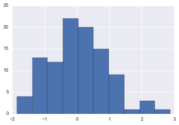


#### Kdeplot
对于连续的变量,光看直方图肯定是不够的,**数据的分布的观察**也是必不可少的,这时我们需要借用KDE(Kernel Density Estimate)函数.


```python
sns.kdeplot(x,shade=True)
```


    <matplotlib.axes._subplots.AxesSubplot at 0xdddae8470>


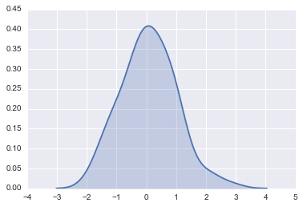


#### Distplot
上面的两个函数非常实用,但是还有一个非常好的函数,distplot函数,该函数包含了绝大多数单变量可视化的能力,可以直接使用distplot实现上面两个函数的功能,此外它还可以绘制出其他的近似分布.

默认的distplot能直接绘制出我们需要的直方图以及对应的核密度估计(KDE).


```python
sns.distplot(x);
```


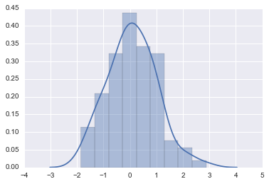


当然如果不想看到kde曲线,我们可以直接将kde去掉,如果只想看kde曲线,我们也可以把直方图去掉.

> **绘制kde曲线一般会比较耗时,所以可以直接将kde设置为False[3].**


```python
sns.distplot(x, kde=False, rug=True);
```


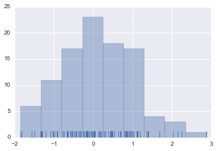


当然也可以将直方图省去.仅看kde曲线.


```python
sns.distplot(x, hist=False, rug=True);
```


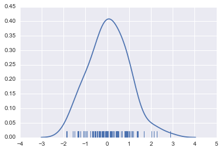


此外还有一个神奇的操作--设置bin的个数,它会生成对应的bin来告诉你数据的一个分布的情况,大致分布在每个bin中的数据有多少,经常可以看到有些人喜欢**通过观察bin来对数据进行切分并做one-hot编码形成新的特征[4] (PS:具体的例子可以参考kaggle的坦坦尼克比赛的kernel)**.


```python
sns.distplot(x, bins=20, kde=False, rug=True);
```


前面说了Distplot可以绘制很多分布,函数内部涵盖了大量的分布函数,可以用来近似拟合数据.这对于熟悉统计的人来说十分有用.例如gamma函数等等.


```python
x = np.random.gamma(6, size=200)
sns.distplot(x, kde=False, fit=stats.gamma);
```


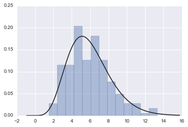


###  连续(continious)的二元变量特征的数据可视化

**<font color=red>上面的数据可视化是基于单变量的,常常用于对连续形式的label(回归问题中较为常见)进行观察处理[5].</font>** 实际问题中我们不会仅仅只对数据进行观察,还需要进行预测等,自然而然的,数据之间关系的分析就显得非常重要.此处我们开始对数据之间的关系进行分析,主要是两个连续变量之间的相关性分析.关于涉及categorical变量的部分我们会在第后续分进行介绍.

这一节我们会介绍如下几个函数matplotlib.pyplot中的scatterplot函数以及seaborn中的jointplot函数.

用多元高斯分布函数生成两个变量x,y.


```python
mean, cov = [0, 1], [(1, .5), (.5, 1)]
data = np.random.multivariate_normal(mean, cov, 200)
df = pd.DataFrame(data, columns=["x", "y"])
```


```python
df.head()
```


<div>
<table border="1" class="dataframe">
  <thead>
    <tr style="text-align: right;">
      <th></th>
      <th>x</th>
      <th>y</th>
    </tr>
  </thead>
  <tbody>
    <tr>
      <th>0</th>
      <td>2.190873</td>
      <td>2.902961</td>
    </tr>
    <tr>
      <th>1</th>
      <td>0.387901</td>
      <td>3.441322</td>
    </tr>
    <tr>
      <th>2</th>
      <td>-1.304909</td>
      <td>0.586173</td>
    </tr>
    <tr>
      <th>3</th>
      <td>-0.016867</td>
      <td>0.907323</td>
    </tr>
    <tr>
      <th>4</th>
      <td>0.284953</td>
      <td>1.189304</td>
    </tr>
  </tbody>
</table>
</div>


#### Scatterplot 

这个函数是通用的,尤其是两个变量都是连续型变量的时候,我们希望看看在二维平面上二者之间的关系时必然会先想到散点图函数,当然**当数据比较多的时候,建议采样观察[6]**,不然真的很耗时.**通过Scatterplot我们可以很容易的发现一些数据的分布规律,是否有簇的存在等等,在涉及类似于经纬度的问题时,我们经常会通过scatterplot看数据,然后考虑聚类等[7]**操作.


```python
plt.scatter(df['x'].values,df['y'].values)
```


    <matplotlib.collections.PathCollection at 0xddea38ef0>


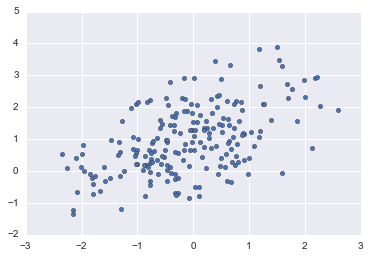


#### Jointplot 

Scatterplot函数是非常实用的,但是用过seaborn的伙伴肯定都还会知道joinplot这个函数,不仅能方便的绘制散点图,同时还融入了很多其他功能,还可以帮我们直接进行一些简单的模型的拟合(linear regression,etc).

默认的Jointplot


```python
sns.jointplot(x="x", y="y", data=df);
```


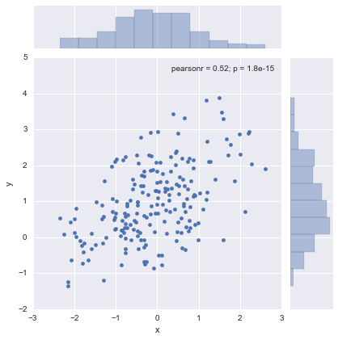


Hexbin绘图和KDE绘图,这两个绘图大致可以更加<font color=red>直观的炫酷的</font>看出数据的一个分布情况(例如hex图,越白的地方数据就越少,基本都没有数据在那里).


```python
sns.jointplot(x="x", y="y", data=df,kind ='hex' );
```


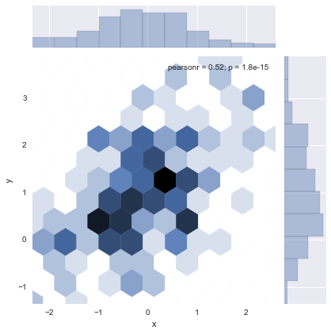


```python
sns.jointplot(x="x", y="y", data=df, kind="kde");
```


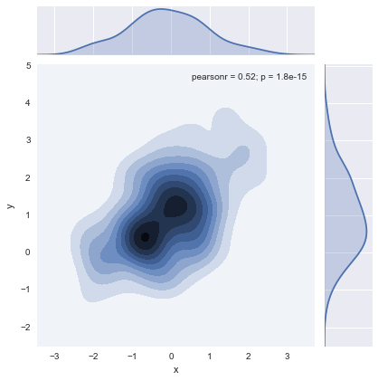


当然还有更多很直观的方式.例如下面就更加直观.(看图自己体会......)


```python
f, ax = plt.subplots(figsize=(6, 6))
cmap = sns.cubehelix_palette(as_cmap=True, dark=0, light=1, reverse=True)
sns.kdeplot(df.x, df.y, cmap=cmap, n_levels=60, shade=True);
```


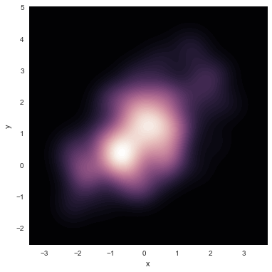


#### 奖励（plot_joint,pairplot）
此处是bous部分,先介绍一个plot_joint函数,该绘图函数可以将很多绘图形式放在同一张图表中,更加丰富我们的视图,这种炫酷的图标一般**在创新创业大赛时特别有用[8]**.

第二是pairplot,这个函数可以同时绘制多个双变量之间的关系,**不过因为需要绘制两两变量之间的关系,所以会非常耗时,而且往往比较稠密,看得有些乱,不太建议使用,不过这些仅是我的个人感受[9]**......


```python
g = sns.jointplot(x="x", y="y", data=df, kind="kde", color="m")
g.plot_joint(plt.scatter, c="w", s=30, linewidth=1, marker="+")

g.ax_joint.collections[0].set_alpha(0)
g.set_axis_labels("$X$", "$Y$");
```


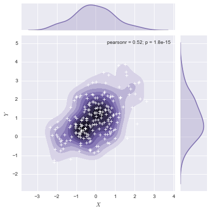


pairplot: 该函数会同时绘制数据中所有特征两两之间的关系图.因为pairplot是建立在pairgrid之上,所以可以将中间的很多函数进行变换,例如下面的kde的例子.


```python
iris = sns.load_dataset("iris")
sns.pairplot(iris);
```


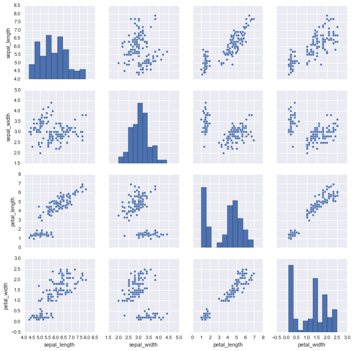


**看两两变量之间的kde绘图,例如sepal_width和petal_length这样的图,我们发现kde图自行进行了聚类,此时我们可以观察两个类中label的情况,比如二分类,如果其中一个类中正样本有80%,另外一个负样本有90%,则考虑进行聚类one-hot操作[10]**.


```python
g = sns.PairGrid(iris)
g.map_diag(sns.kdeplot)
g.map_offdiag(sns.kdeplot, cmap="Blues_d", n_levels=6);
```


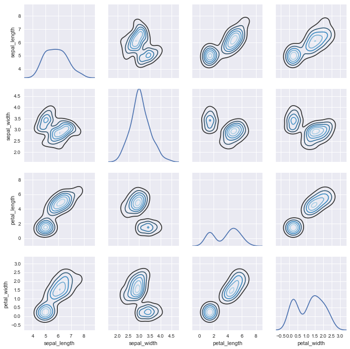


```python
g = sns.PairGrid(iris)
g.map_diag(sns.kdeplot)
g.map_offdiag(sns.kdeplot);
```


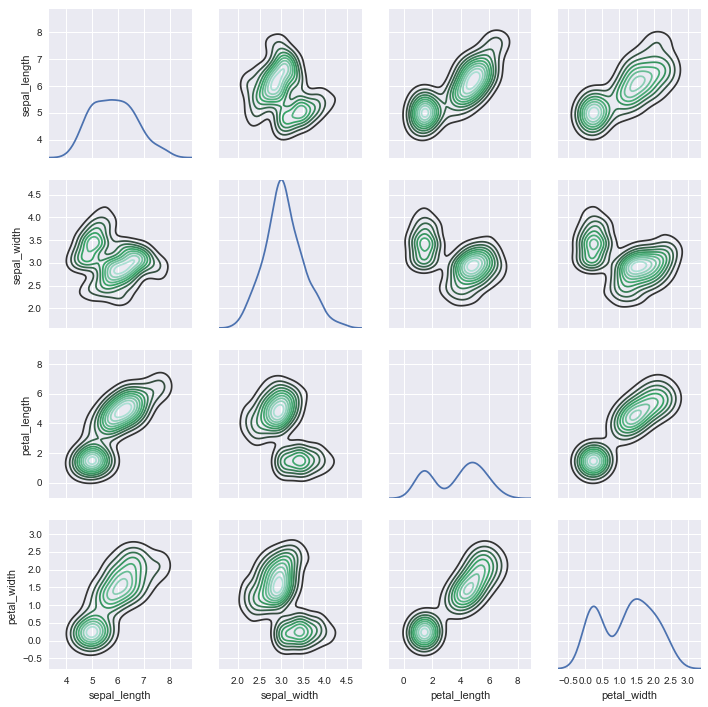


## 带有类别属性的数据可视化(categorical data)
** $~~~$ 很多数据中都存在大量的categorical数据,例如花朵的颜色(红,黄,蓝),体重的等级(偏重,偏轻,正常)等等.此处我们会重点介绍这一类的数据. **

老规矩，我们先导入我们所需的包以及数据集.


```python
import numpy as np
import pandas as pd
import matplotlib as mpl
import matplotlib.pyplot as plt
```


```python
import seaborn as sns
sns.set(style="whitegrid", color_codes=True)
%matplotlib inline
```


```python
np.random.seed(sum(map(ord, "categorical")))
```


```python
titanic = sns.load_dataset("titanic")
tips = sns.load_dataset("tips")
iris = sns.load_dataset("iris")
```


```python
tips.head()
```


<div>
<table border="1" class="dataframe">
  <thead>
    <tr style="text-align: right;">
      <th></th>
      <th>total_bill</th>
      <th>tip</th>
      <th>sex</th>
      <th>smoker</th>
      <th>day</th>
      <th>time</th>
      <th>size</th>
    </tr>
  </thead>
  <tbody>
    <tr>
      <th>0</th>
      <td>16.99</td>
      <td>1.01</td>
      <td>Female</td>
      <td>No</td>
      <td>Sun</td>
      <td>Dinner</td>
      <td>2</td>
    </tr>
    <tr>
      <th>1</th>
      <td>10.34</td>
      <td>1.66</td>
      <td>Male</td>
      <td>No</td>
      <td>Sun</td>
      <td>Dinner</td>
      <td>3</td>
    </tr>
    <tr>
      <th>2</th>
      <td>21.01</td>
      <td>3.50</td>
      <td>Male</td>
      <td>No</td>
      <td>Sun</td>
      <td>Dinner</td>
      <td>3</td>
    </tr>
    <tr>
      <th>3</th>
      <td>23.68</td>
      <td>3.31</td>
      <td>Male</td>
      <td>No</td>
      <td>Sun</td>
      <td>Dinner</td>
      <td>2</td>
    </tr>
    <tr>
      <th>4</th>
      <td>24.59</td>
      <td>3.61</td>
      <td>Female</td>
      <td>No</td>
      <td>Sun</td>
      <td>Dinner</td>
      <td>4</td>
    </tr>
  </tbody>
</table>
</div>


### Other变量&类别变量
当我们的数据中有两个变量,其中包含一个categorical变量.另外一个可以是categorical,也可以是其他的变量,这个时候我们常常会用stripplot()函数来绘制二者的关系.

** <font color =red>常见于用来分析label为连续型变量(回归问题中的label),而我们特征中出现了categorical数据[1].</fonr>**

而针对这些问题,在seaborn中最常用的函数有striplot和searmplot函数.

#### Stripplot函数


```python
sns.stripplot(x="day", y="total_bill", data=tips);
```


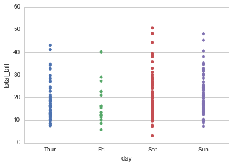


但是我们很快便发现一个较为严重的问题,就是这样无法很好体现我们label在某个点的分布情况,可能一个点附近有大量的点,但上面那个图我们却是很难发现的(覆盖太严重),为了解决这个问题,我们采用random jitter,将同一个地方的点随机的分开,因为是随机的,所以每次运行都会不一样,具体的结果如下所示,这样我们就很容易的看到categorical变量对于label的影响.


```python
sns.stripplot(x="day", y="total_bill", data=tips, jitter=True);
```


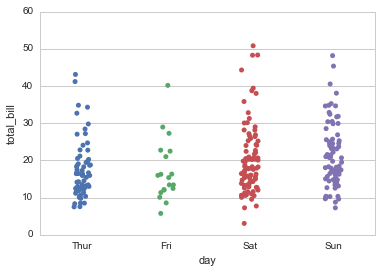


```python
sns.stripplot(x="day", y="total_bill", data=tips, jitter=True);
```


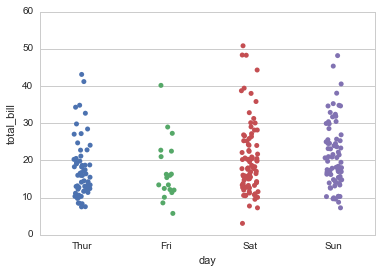


#### Swarmplot函数
虽然stripplot的jitter = True在一定程度上缓解了该问题,但是还有一个更好的函数swarmplot,该函数利用一种特定算法使得我们的能更好的看到数据的分布情况.


```python
sns.swarmplot(x="day", y="total_bill", data=tips);
```


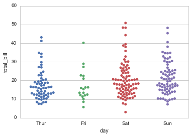


#### Stripplot VS Swarmplot
① **swarmplot的优势在当我们的两个变量都是categorical的时候更加明显[2]**.具体的参考下图即可.

② **swarmplot的缺点则是非常耗时,当数据量非常大的时候并不适用[3]**.


```python
ok,[ax0,ax1] = plt.subplots(nrows=2,ncols=1,figsize = [12,8])
sns.stripplot(x="size", y="size", data=tips,jitter= True, ax = ax0);
sns.swarmplot(x="size", y="size", data=tips,ax = ax1);
```


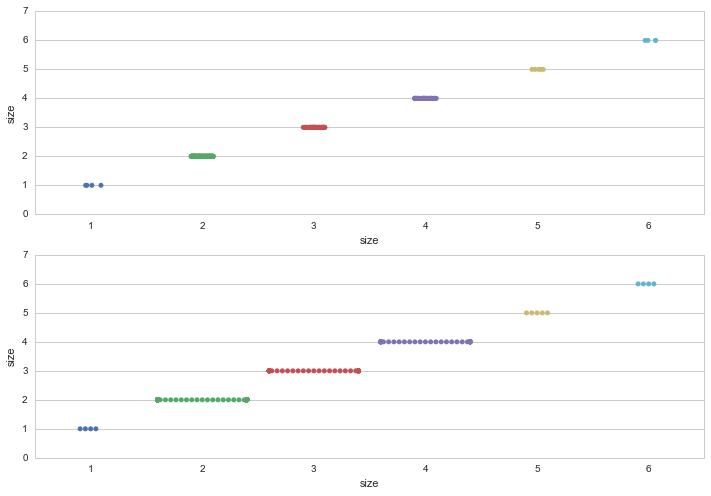


### 类别特征对应的特征分布
在某种程度上,类别型数据的可视化可能会无法反应某类中信息的一个分布情况,例如上面的day和total_bill的情况,在很多情况下较难看出究竟哪一天total_bill的好一点,尤其在两个类别中total都相近的时候(Sta,Sun),那此时我们就需要另外一些更好的可视化工具来帮助我们完成这些任务. 


而针对这些问题,在seaborn中最常见的函数有Boxplots和Violinplot函数.

#### Boxplots 
Boxplots大家见的应该比较多,就是盒图的意思,我们可以通过boxplot很容易的看到我们数据的一个平均情况,包括均值,四分位数之类的信息.


```python
sns.boxplot(x="day", y="total_bill", data=tips);
```


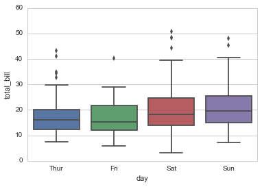


**一个小的tips**: 因为hue是和x,y变量嵌套的,当我们使用hue变量的时候,它会被分割出来并产生"位移",也就是我们看到的下面的一条线被分割成为多条线的情况. 有时为了防止位移,我们可以设置dodge=False可以抵消位移.

> For boxplots, the assumption when using a hue variable is that it is nested within the x or y variable. This means that by default, the boxes for different levels of hue will be offset, as you can see above. If your hue variable is not nested, you can set the dodge parameter to disable offsetting:

具体的例子已看便可以明白. 

<font /color = red>当然有的时候我们不需要位移,即每个categorical的x轴对应的y都只有一个类型,那么此时的位移反而会使得我们的图变得很难看,所以这个时候我们可以选择将dodge设置为False[4]. </font>


```python
sns.boxplot(x="day", y="total_bill", hue="size", data=tips, dodge=False);
```


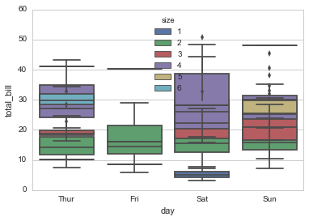


```python
sns.boxplot(x="day", y="total_bill", hue="size", data=tips);
```


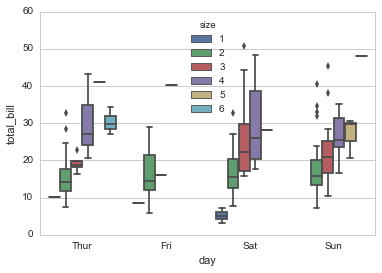


```python
tips["weekend"] = tips["day"].isin(["Sat", "Sun"])
sns.boxplot(x="day", y="total_bill", hue="weekend", data=tips, dodge=False);
```


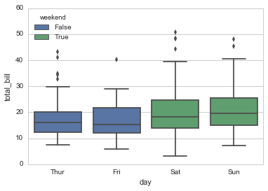


#### Violinplot
这个函数集成了boxplot和KDE,看上去也很高大上,经常可以看到,通过看violinplot函数的分布我们很容易观察某一类对应的特征**(一般会是label)[5]**的分布情况。能了解该cate对应的特征的情况.


```python
sns.violinplot(x="day", y="total_bill", hue="time", split=True, data=tips);
```


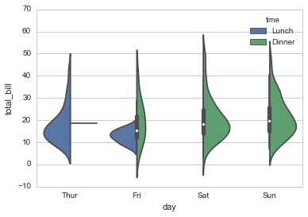


#### Violinplot 与 Swarmplot
**其实我们发现这个函数和我们的swarmplot很类似,但是violinplot能让我们一眼就识别出数据的分布情况.非常清晰直观.**


```python
sns.violinplot(x="day", y="total_bill", hue="time", split=True, data=tips);
```


```python
sns.swarmplot(x = 'day', y ='total_bill',hue="time",data = tips)
```


    <matplotlib.axes._subplots.AxesSubplot at 0xde0136828>


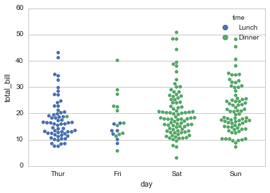


**我们可以将violinplot和swarmplot二者进行合并并给出更加直观的表示.**具体的如下


```python
sns.violinplot(x="day", y="total_bill", data=tips, inner=None)
sns.swarmplot(x="day", y="total_bill", data=tips, color="w", alpha=.5);
```


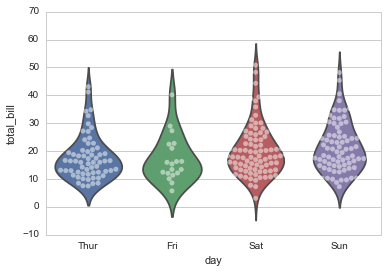


### 类别特征的统计信息
上面的几种关于categorical特征的可视化技术主要用以观察数据的分布的情况,但是却总感觉缺了一些东西,究竟是什么呢？作为做过一些数据分析的我们很容易就明白,我们**不能仅仅只看数据的一个外在的表现,我们需要一些工具将它的一些内在信息(主要是统计信息)反应出来,例如某类数据的总的个数,均值等情况[6]**.

此处主要介绍barplot.


#### Barplot
<font color = red>barplot需要注意的是纵轴y默认的是计算的对应cate的**均值[7]**.</font>


```python
sns.barplot(x="sex", y="survived", data=titanic);
```


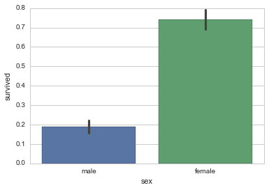


```python
sns.barplot(x="sex", y="survived", hue="class", data=titanic);
```


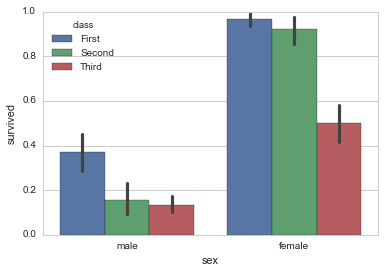


#### Countplot
我们发现上面的barplot会默认将纵轴计算为均值,这在二分类的时候非常有帮助,因为均值就是为1的概率,但是**是不是具有统计意义,我们不能只看概率还得看个数[7]**，这个时候我们就得用到countplot函数了,coutplot函数不能同时使用x,y所以如果想要统计某个cate变量对应的变量的个数最好用hue进行分开.例子如下:


```python
sns.countplot(hue="sex", x="survived", data=titanic, palette="Greens_d");
```


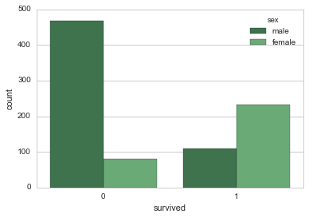


#### Pointplot
另外还有一种比较常用的具有类似功能的函数是Pointplot函数,这个函数和Barplot很相似，y特征都是计算对应的概率,不同的是该函数更加丰富,它还会对相同的hue特征进行连接,得到特征的变化曲线.只是个人感觉这样的点不如方形看得舒服......


```python
sns.pointplot(x="sex", y="survived", hue="class", data=titanic);
```


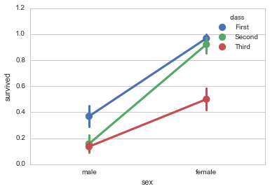


```python
sns.pointplot(x="sex", y="survived", hue="class", data=titanic,
              palette={"First": "g", "Second": "m", "Third":'b'},
              markers=["^", "o","+"], linestyles=["-", "--",""]);
```


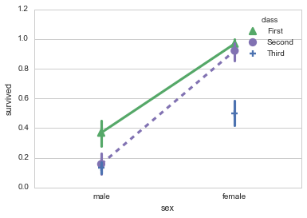


```python
# orient="h"表示按横轴绘制
sns.boxplot(data=iris, orient="h");
```


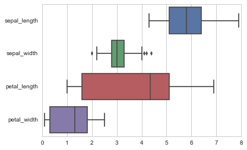


```python
f, ax = plt.subplots(figsize=(7, 3))
sns.countplot(y="deck", data=titanic, color="c");
```


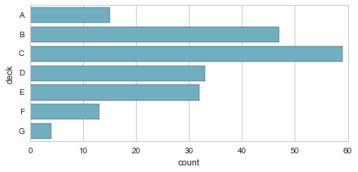


### 奖励（Bonus）部分

上述方法已经能解决大部分有带有类别特征的数据的可视化问题,此处我们介绍两个更加高级的方法.这些方法将上面的方法集中在一起,可是随时调用.上述的方法可以通过kind = ""进行随时的切换.

下面我们就会介绍seaborn中的Factorplot函数(默认是kind = "pinpoint")和PairGrid函数.

#### Factorplot


```python
sns.factorplot(x="day", y="total_bill", hue="smoker", data=tips);
```


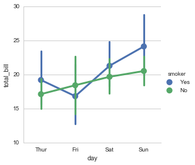


如果我们希望barplot的形式的话,将kind设置为bar即可.为了对比,此处我们也绘制barplot的形式,是不是发现和barplot一样的结果.


```python
sns.factorplot(x="day", y="total_bill", hue="smoker", kind = 'bar', data=tips);
```


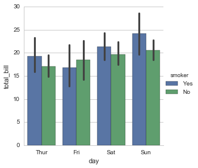


```python
sns.barplot(x="day", y="total_bill", hue="smoker", data=tips)
```


    <matplotlib.axes._subplots.AxesSubplot at 0xddfa889b0>


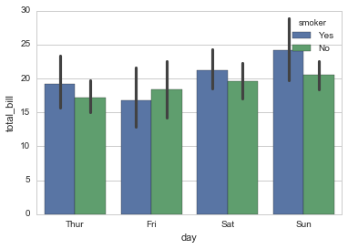


** 这边我们再补充一个功能,col = [],<font color=red>[]中一般为categorical特征</font>,这样我们就可以结合x,y,hue,col来观察四种特征之间的相关性了[8]. ** 是不是很绚！


```python
sns.factorplot(x="day", y="total_bill", hue="smoker",col="time", data=tips, kind="swarm");
```


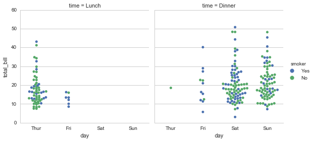


```python
sns.factorplot(x="time", y="total_bill", hue="smoker", col="day", data=tips, kind="box", size=4, aspect=.5);
```


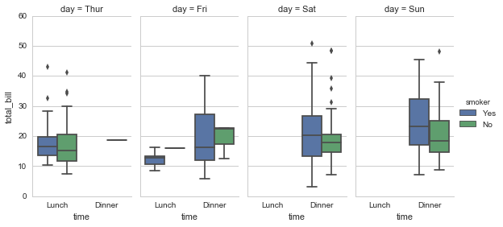


#### PairGrid
这个函数很厉害,第一节的Pairplot就是基于该函数,可以同时采用某一个绘图方式(例如barplot,violinplot)观察很多组变量之间的关系，这个处理相同类型的数据时比较好(比如我希望以violinplot函数查看变量A与变量B之前的关系以及变量A与变量C之间的关系,这个时候为了方便我们会将他们放在一起进行查看),我很少用,但是大家可以参考着使用.


```python
g = sns.PairGrid(tips,x_vars=["smoker", "time", "sex"],y_vars=["total_bill", "tip"],aspect=.75, size=3.5)
g.map(sns.violinplot, palette="pastel");
```


```python
g = sns.PairGrid(tips,x_vars=["smoker", "time", "sex"],y_vars=["total_bill", "tip"],aspect=.75, size=3.5)
g.map(sns.barplot, palette="pastel");
```


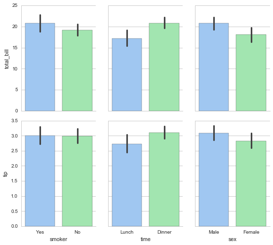


### 总结
这一节我们介绍了一些用于查看categorical变量与其他变量(一般是label)之间关系的一些可视化技巧(大家在看kernel分享或者其他开源的数据分析的时候肯定也有接触过),其中主要涉及的包有:

- 查看cate变量与一些其他变量(连续或者cate):Stripplot,Swarmplot(一般是cate对应变量出现overlap比较严重的时候使用) 
- 查看cate变量对应的其他变量分布:Boxplot,Violinplot
- 查看cate变量对应变量(含一些统计特征):Barplot,Countplot,Pointplot
- 集成的函数:Factorplot和PairGrid.

希望能对大家带来帮助.

## 变量关系可视化(Visualizing relationships between variables)
** 前面两节的内容其实已经适用于80%的数据竞赛问题了,这一节的内容可以当做是补充,这一节讲述的东西常较为适用于一些回归问题<font color=red>同时可以帮助我们进行一些好的特征的构造</font>. **

数据与包的导入.


```python
import numpy as np
import pandas as pd
import matplotlib as mpl
import matplotlib.pyplot as plt
import seaborn as sns
sns.set(color_codes=True)
%matplotlib inline
np.random.seed(sum(map(ord, "regression")))
```


```python
tips = sns.load_dataset("tips")
```


```python
tips.head()
```


<div>
<table border="1" class="dataframe">
  <thead>
    <tr style="text-align: right;">
      <th></th>
      <th>total_bill</th>
      <th>tip</th>
      <th>sex</th>
      <th>smoker</th>
      <th>day</th>
      <th>time</th>
      <th>size</th>
    </tr>
  </thead>
  <tbody>
    <tr>
      <th>0</th>
      <td>16.99</td>
      <td>1.01</td>
      <td>Female</td>
      <td>No</td>
      <td>Sun</td>
      <td>Dinner</td>
      <td>2</td>
    </tr>
    <tr>
      <th>1</th>
      <td>10.34</td>
      <td>1.66</td>
      <td>Male</td>
      <td>No</td>
      <td>Sun</td>
      <td>Dinner</td>
      <td>3</td>
    </tr>
    <tr>
      <th>2</th>
      <td>21.01</td>
      <td>3.50</td>
      <td>Male</td>
      <td>No</td>
      <td>Sun</td>
      <td>Dinner</td>
      <td>3</td>
    </tr>
    <tr>
      <th>3</th>
      <td>23.68</td>
      <td>3.31</td>
      <td>Male</td>
      <td>No</td>
      <td>Sun</td>
      <td>Dinner</td>
      <td>2</td>
    </tr>
    <tr>
      <th>4</th>
      <td>24.59</td>
      <td>3.61</td>
      <td>Female</td>
      <td>No</td>
      <td>Sun</td>
      <td>Dinner</td>
      <td>4</td>
    </tr>
  </tbody>
</table>
</div>


### 双变量的线性回归函数 

#### Regplot & Lmplot (简单的线性关系(不存在奇异值))

数据关系的探索,最简单的就是线性关系的探索,这是最常见的问题,尤其在很多回归问题中.在seaborn函数中也有两个较为流行的函数,**regplot()和lmplot(),直接调用的时候二者其实是差不多的,除了figure的大小不一样,很多时候直接默认使用即可[1]**,但是既然是两个函数，肯定还是有区别的,这边直接套用官网文档的话来阐述二者之间的不同:

> regplot accepts the x and y variables in a variety of formats including ** simple numpy arrays, pandas Series objects, or as references to variables in a pandas DataFrame object passed to data **. In contrast, lmplot() has data as a required parameter and the **x and y variables must be specified as strings**. This data format is called “long-form” or “tidy” data. Other than this input flexibility, regplot() possesses a subset of lmplot()'s features, so we will demonstrate them using the latter. 

**正常情况.**


```python
sns.regplot(x="total_bill", y="tip", data=tips);
```


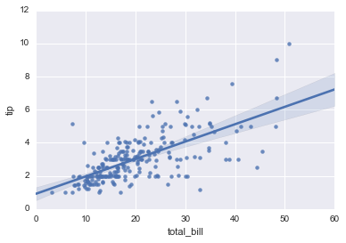


```python
sns.lmplot(x="total_bill", y="tip", data=tips);
```


####  Lmplot (带有奇异值的线性关系)

**存在明显奇异值的情况:**这个时候可以选用robust的线性回归.


```python
anscombe = sns.load_dataset("anscombe")
anscombe.head()
```


<div>
<table border="1" class="dataframe">
  <thead>
    <tr style="text-align: right;">
      <th></th>
      <th>dataset</th>
      <th>x</th>
      <th>y</th>
    </tr>
  </thead>
  <tbody>
    <tr>
      <th>0</th>
      <td>I</td>
      <td>10.0</td>
      <td>8.04</td>
    </tr>
    <tr>
      <th>1</th>
      <td>I</td>
      <td>8.0</td>
      <td>6.95</td>
    </tr>
    <tr>
      <th>2</th>
      <td>I</td>
      <td>13.0</td>
      <td>7.58</td>
    </tr>
    <tr>
      <th>3</th>
      <td>I</td>
      <td>9.0</td>
      <td>8.81</td>
    </tr>
    <tr>
      <th>4</th>
      <td>I</td>
      <td>11.0</td>
      <td>8.33</td>
    </tr>
  </tbody>
</table>
</div>


```python
sns.lmplot(x="x", y="y", data=anscombe.query("dataset == 'III'"),ci=None, scatter_kws={"s": 80});
```


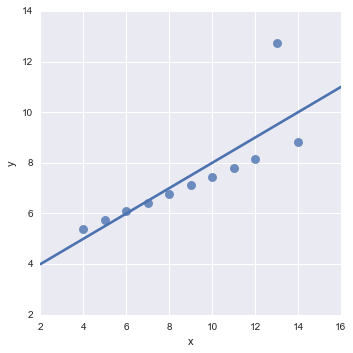


```python
sns.lmplot(x="x", y="y", data=anscombe.query("dataset == 'III'"),robust=True, ci=None, scatter_kws={"s": 80});
```


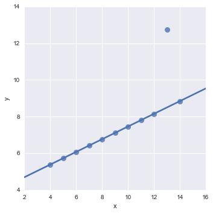


#### Residplot (Bonus部分,线性关系的判断）
上面的线性关系图,我们已经可以直接观察到我们的数据是否满足线性关系,此处我们介绍的是另外一种判别我们的数据是否满足线性关系的可视化方法.

①**residplot**: 如果数据在我们的残差线的上下方随机分布,我们认为数据是满足线性分布的.如果任何一方(上方或者下方)远大于另外一方的时候,我们的数据一般是不满足线性关系的**[2]**.

此外还有另外两种比较好的方法来判别数据的线性相关性**[3]**:

② 通过上面regplot或者lmplot的可视化方式来判断;

③ 通过泊松系数来判别线性相关性.


线性相关的情况.


```python
sns.residplot(x="x", y="y", data=anscombe.query("dataset == 'I'"),scatter_kws={"s": 80});
```


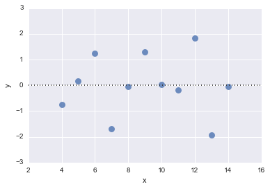


非线性相关的情况.


```python
sns.residplot(x="x", y="y", data=anscombe.query("dataset == 'II'"),scatter_kws={"s": 80});
```


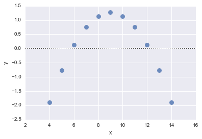


### 局部线性,全局非线性 (Lmplot)
这种关系我们经常会用lowess smoother技术来处理,如果能发现这种关系,并**将局部的线性拟合的值作为特征进行加入,那么绝大是非常大的加分[4]**. 


```python
sns.lmplot(x="total_bill", y="tip", data=tips,lowess=True);
```


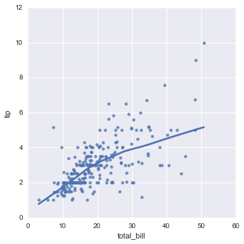


### 一些简单高阶(二阶三阶)的关系探索 (Lmplot)
上面是最简单的线性关系,但是并非所有的数据都是线性相关的,还有二次关系或者其他关系的数据存在.例如下面dataset为第二种类型的情况. 这些关系在实践中如何使用呢?**可以通过直接线性拟合预测得到的结果融入到model中.例如作为xgb或者其他模型的一个特征[5].**


```python
sns.lmplot(x="x", y="y", data=anscombe.query("dataset == 'I'"),ci=None, scatter_kws={"s": 80});
```


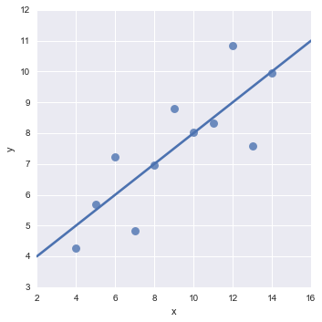


**二次关系的情况.三次四次等情况都可以直接设置order = N 来控制[6].**


```python
sns.lmplot(x="x", y="y", data=anscombe.query("dataset == 'II'"),ci=None, scatter_kws={"s": 80});
```


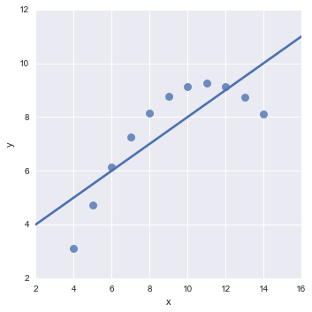


```python
sns.lmplot(x="x", y="y", data=anscombe.query("dataset == 'II'"),order=2, ci=None, scatter_kws={"s": 80});
```


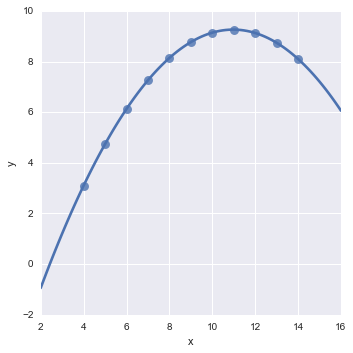


### 聚类之后的线性回归(Lmplot,更高维度审视线性回归)
该部分和之前一样就是加入了hue,col,row(**主要针对categorical数据**)等操作,使得我们可以站在更高维度的空间来审视我们的数据,我将这个看做是类似于聚类之后的回归.之前没怎么使用过这种方法,最近看文档学习的,感觉非常有用. 如果发现某个子图中某两个变量存在完全的线性相关性,那么肯定是非常棒的！


```python
sns.lmplot(x="total_bill", y="tip", hue="smoker", data=tips);
```


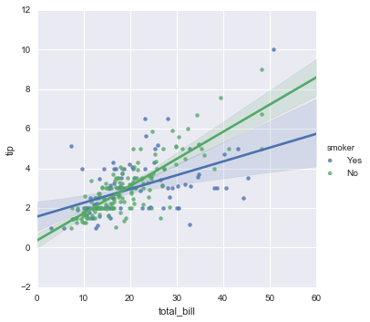


```python
sns.lmplot(x="total_bill", y="tip", hue="smoker", data=tips, markers=["o", "x"], palette="Set1");
```


```python
sns.lmplot(x="total_bill", y="tip", hue="smoker", col="time", row="sex", data=tips);
```


### 附录补充(Jointplot('reg'),Pairplot('reg'))
还有很多其他可视化函数自带绘制线性回归的功能.例如joinplot,pairplot等.这里大家了解一下即可.


```python
sns.jointplot(x="total_bill", y="tip", data=tips, kind="reg");
```


```python
sns.pairplot(tips, x_vars=["total_bill", "size"], y_vars=["tip"],hue="smoker", size=5, aspect=.8, kind="reg");
```


## 引用
[1] http://seaborn.pydata.org/tutorial/distributions.html <br />
[2] http://seaborn.pydata.org/tutorial/categorical.html <br />
[3] http://seaborn.pydata.org/tutorial/regression.html <br />


```python

```
